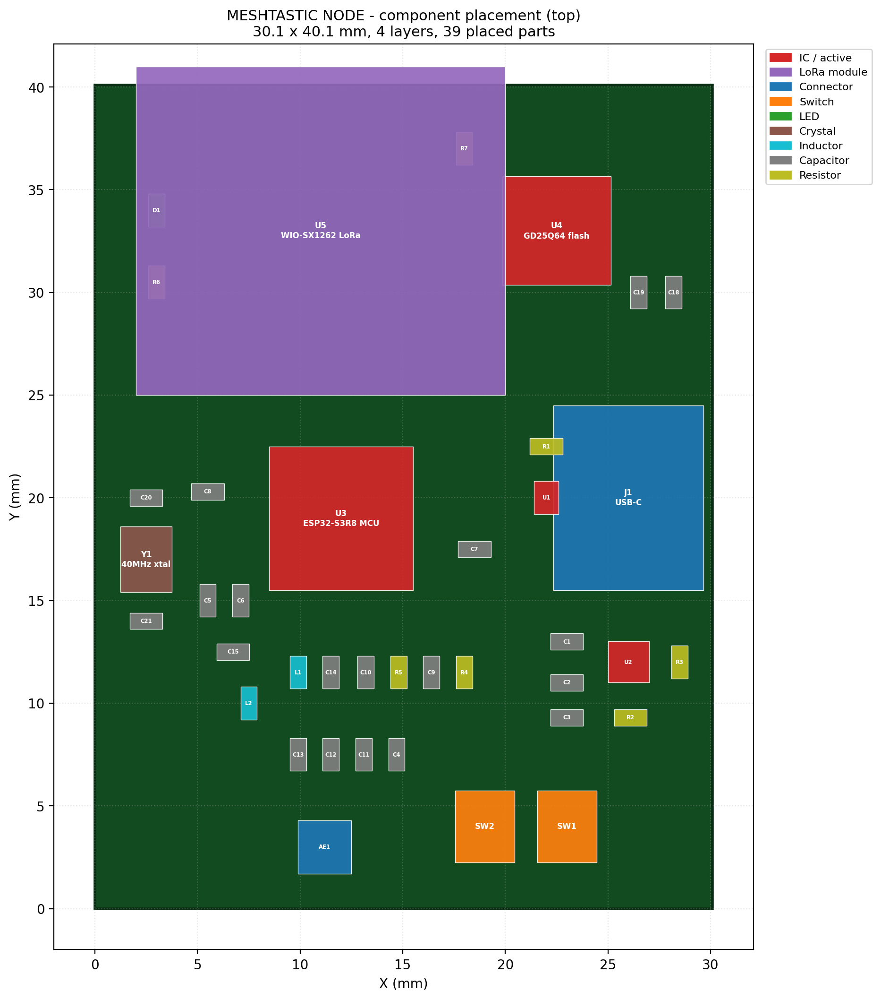
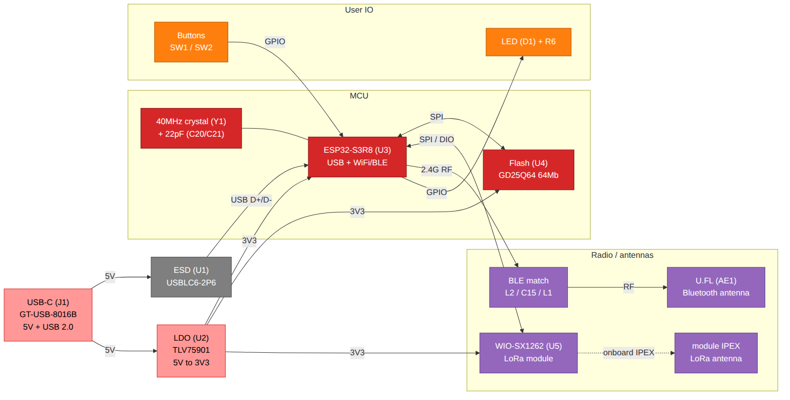
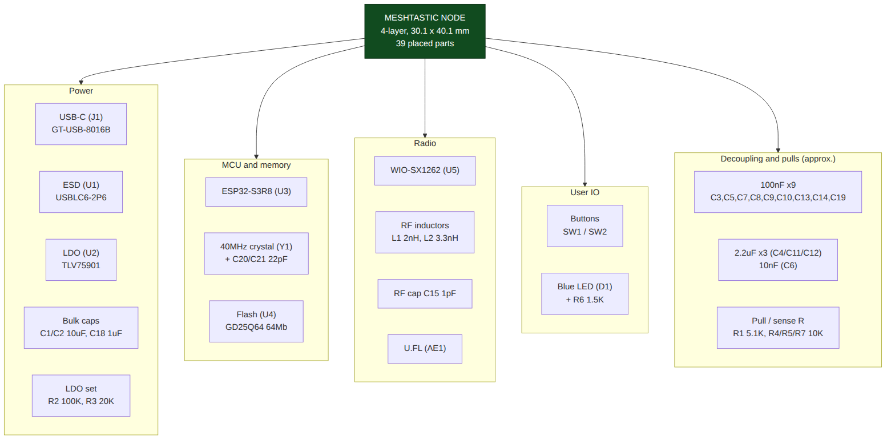

# Hardware diagrams

Generated views of the MESHTASTIC NODE board. Regeneration steps and the
readability checklist live in the top-level `CLAUDE.md`.

## Component placement (to scale)

Every placed part at its real X/Y from the pick-and-place file, on the actual
30.1 x 40.1 mm outline. Generated by `../tools/placement_diagram.py` (matplotlib);
Mermaid cannot represent physical placement, so this view stays a rendered PNG.

## Functional block diagram

Source: [`block-diagram.mmd`](block-diagram.mmd). Nets are inferred from the BOM
and the standard ESP32-S3 + SX1262 topology, not extracted from a schematic.

## Component overview

Source: [`component-overview.mmd`](component-overview.mmd). All parts grouped by
subsystem; passive groupings are approximate.
